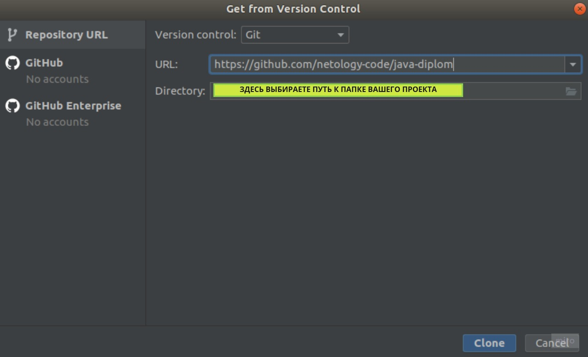
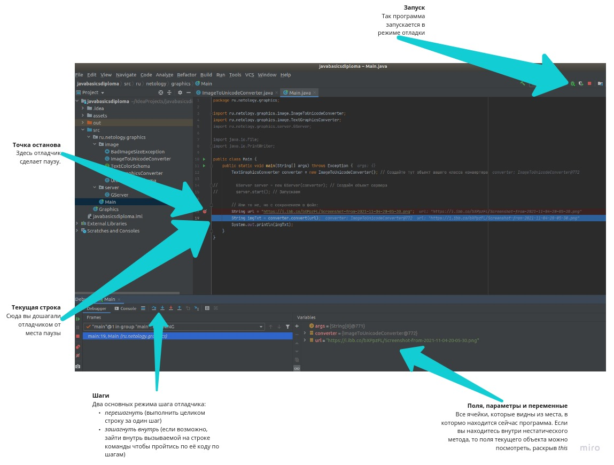

# Конвертер в текстовую графику
# [Решение](https://github.com/MarselFazlyev/Konverter-to-text-graphics)

Вас пригласили поучаствовать в разработке приложения, умеющего скачивать картинки по URL и конвертировать изображения в текстовую графику (т. е. текст из разных символов, которые в совокупности выглядят как изображение). Вот пример его работы (картинка на нём — это текст из мелких символов):


## Скачиваем проект
Часть приложения уже написана и вашей задачей будет доработка его основной логической части в соответствии с требованиями. Поэтому для начала работы нам нужно будет скачать заготовку проекта. Для этого откройте идею, выберите в меню `File -> New -> Project from Version Control`. В открывшемся окне в поле URL введите `https://github.com/netology-code/java-diplom` как показано на картинке и нажмите Clone:



После того как идея скачает проект, надо убедиться, что для него выбрана версия джавы. Откройте `File -> Project structure` и убедитесь, что это так. Версия джавые должна быть не меньше 11й.


После чего откройте класс `Main` и запустите метод `main`. Запуск должен завершиться следующей ошибкой:
```
Exception in thread "main" java.lang.IllegalArgumentException: Серверу нужно передать в конструктор объект-конвертер, а было передано null.
	at ru.netology.graphics.server.GServer.<init>(GServer.java:24)
	at ru.netology.graphics.Main.main(Main.java:13)
```

Если вы видите эту ошибку, то значит проект настроен верно. Если нет - напишите своему руководителю по курсовой, он подскажет с настройкой.

## Структура проекта
Перед вами обычный джава-проект с несколькими незнакомыми вам папками (например, `assets`), которые вам всё равно не нужно будет трогать. Нас будут интересовать .java-файлы, которые располагаются по следующим пакетам:


| Класс / Интерфейс      | Для чего? |
| ----------- | ----------- |
| `BadImageSizeException`      | Класс исключения, которое вы будете выбрасывать       |
| `TextColorSchema`   | Интерфейс цветовой схемы, который вы будете реализовывать        |
| `TextGraphicsConverter`   | Интерфейс конвертера картинок, который вы будете реализовывать        |
| `GServer`   | Готовый класс сервера, который будет использовать ваш конвертер; вам туда лезть не нужно        |
| `Main`   | Запуск приложения. В нём запускается сервер, также в нём можно будет конвертировать картинки в текстовые файлы без сервера        |

## Требования к конвертеру
В проекте уже за вас написан класс сервера, который будет использовать ваш конвертер. Тк ваш конвертер ещё не написан, то был создан специальный интерфейс `TextGraphicsConverter`, объект которого сервер ждёт параметром в `Main`:

```java
        TextGraphicsConverter converter = null; // Создайте тут объект вашего класса конвертера

        GServer server = new GServer(converter); // Создаём объект сервера
        server.start(); // Запускаем
```

Все требования к конвертеру [описаны](src/ru/netology/graphics/image/TextGraphicsConverter.java) в интерфейсе и чуть ниже мы их подробнее разберём. Самый главный метод это метод `convert`, который принимает параметром урл в виде текста (например, `"https://raw.githubusercontent.com/netology-code/java-diplom/main/pics/simple-test.png"`), внутри метода качает и анализирует картинку, после чего отдаёт значение типа `String`, в котором содержится это изображение в виде текстовой графики. В конце каждой строчки текстового изображения находится символ переноса строки, который в джаве пишется как `\n`.

Пример работы конвертера, результат работы которого выводим в консоль:
```java
        String url = "https://raw.githubusercontent.com/netology-code/java-diplom/main/pics/simple-test.png";
        String imgTxt = converter.convert(url);
        System.out.println(imgTxt);
```

В итоге мы видим такой результат, где более тёмные участки заменяются на более "жирные" символы, а светлые на более незаметные символы:


Также интерфейс конвертера требует от него иметь возможность вытавлять ему определённые настройки перед конвертацией:
- Можно установить максимально допустимое соотношение сторон (ширины и высоты); если метод не вызывали, то любое соотношение допустимо;
- Можно установить максимально допустимую высоту итогового изображения; если метод не вызывали, то любая высота допустима;
- Можно установить максимально допустимую ширину итогового изображения; если метод не вызывали, то любая ширина допустима;
- Можно установить текстовую цветовую схему — объект специального интерфейса, который и будет отвечать за превращение степени белого (числа от 0 до 255) в символ; если метод не вызывали, то должен использоваться объект написанного вами класса как значение по умолчанию.

Например, следующий конвертер не должен конвертировать, если ширина больше длины в три раза, тк максимальное соотношение сторон ему выставлено в 2:
```java
        TextGraphicsConverter converter = ...; // Создайте тут объект вашего класса конвертера
	converter.setMaxRatio(2);  // выставляет максимально допустимое соотрношение сторон картинки
	String imgTxt = converter.convert(...); // для слишком широкой картинки должно выброситься исключение BadImageSizeException.
```

Общая схема работы метода `convert` будет соответствовать следующей последовательности действий (они подробнее описаны ниже):
1. Скачиваем картинку по URL;
2. Менеджеру могли выставить максимально допустимое соотношение сторон (ширины и высоты); если оно слишком большое, то конвертация не делается и выбрасывается исключение;
3. При конвертации мы будем менять каждый пиксель на символ: чем пиксель темнее, тем «жирнее» символ, который мы подставим. Менеджеру могли выставить максимальные ширину и высоту итоговой картинки, при этом если исходная картинка больше, то нам надо уменьшить её размер, соблюдая пропорции;
4. Превращаем цветное изображение в чёрно-белое (чтобы мы смотрели только на интенсивность цвета, а не подбирали для красного одни символы, для зелёного другие и т. п);
1. Перебираем все пиксели изображения, спрашивая у них степень белого (число от 0 до 255, где 0 — это чёрный, а 255 — это светлый). В зависимости от этого числа выбираем символ из заранее подготовленного набора;
1. Собираем все полученные символы в единую строку, отдаём как результат конвертации.

Костяк метода `convert`:
```java
    @Override
    public String convert(String url) throws IOException, BadImageSizeException {
        // Вот так просто мы скачаем картинку из интернета :)
        BufferedImage img = ImageIO.read(new URL(url));

        // Если конвертер попросили проверять на максимально допустимое
        // соотношение сторон изображения, то вам здесь надо сделать эту проверку,
        // и, если картинка не подходит, выбросить исключение BadImageSizeException.
        // Чтобы получить ширину картинки, вызовите img.getWidth(), высоту - img.getHeight()

        // Если конвертеру выставили максимально допустимые ширину и/или высоту,
        // вам надо по ним и по текущим высоте и ширине вычислить новые высоту
        // и ширину.
        // Соблюдение пропорций означает, что вы должны уменьшать ширину и высоту должны
        // в одинаковое количество раз.
        // Пример 1: макс. допустимые 100x100, а картинка 500x200. Новый размер
        // будет 100x40 (в 5 раз меньше).
        // Пример 2: макс. допустимые 100x30, а картинка 150x15. Новый размер
        // будет 100x10 (в 1.5 раза меньше).
        // Подумайте, какими действиями можно вычислить новые размеры.
        // Не получается? Спросите вашего руководителя по курсовой, поможем!
        int newWidth = ???;
        int newHeight = ???;

        // Теперь нам надо попросить картинку изменить свои размеры на новые.
        // Последний параметр означает, что мы просим картинку плавно сузиться
        // на новые размеры. В результате мы получаем ссылку на новую картинку, которая
        // представляет собой суженную старую.
        Image scaledImage = img.getScaledInstance(newWidth, newHeight, BufferedImage.SCALE_SMOOTH);

        // Теперь сделаем её чёрно-белой. Для этого поступим так:
        // Создадим новую пустую картинку нужных размеров, заранее указав последним
        // параметром чёрно-белую цветовую палитру:
        BufferedImage bwImg = new BufferedImage(newWidth, newHeight, BufferedImage.TYPE_BYTE_GRAY);
        // Попросим у этой картинки инструмент для рисования на ней:
        Graphics2D graphics = bwImg.createGraphics();
        // А этому инструменту скажем, чтобы он скопировал содержимое из нашей суженной картинки:
        graphics.drawImage(scaledImage, 0, 0, null);

        // Теперь в bwImg у нас лежит чёрно-белая картинка нужных нам размеров.
        // Вы можете отслеживать каждый из этапов, просто в любом удобном для
        // вас моменте сохранив промежуточную картинку в файл через:
        // ImageIO.write(imageObject, "png", new File("out.png"));
        // После вызова этой инструкции у вас в проекте появится файл картинки out.png

        // Теперь давайте пройдёмся по пикселям нашего изображения.
        // Если для рисования мы просили у картинки .createGraphics(),
        // то для прохода по пикселям нам нужен будет этот инструмент:
        WritableRaster bwRaster = bwImg.getRaster();

        // Он хорош тем, что у него мы можем спросить пиксель на нужных
        // нам координатах, указав номер столбца (w) и строки (h)
        // int color = bwRaster.getPixel(w, h, new int[3])[0];
        // Выглядит странно? Согласен. Сам возвращаемый методом пиксель — это 
        // массив из трёх интов, обычно это интенсивность красного, зелёного и синего.
        // Но у нашей чёрно-белой картинки цветов нет, и нас интересует
        // только первое значение в массиве. Вы спросите, а зачем 
        // мы ещё параметром передаём интовый массив на три ячейки?
        // Дело в том, что этот метод не хочет создавать его сам и просит
        // вас сделать это, а сам метод лишь заполнит его и вернёт.
        // Потому что создавать массивы каждый раз слишком медленно. Вы можете создать
        // массив один раз, сохранить в переменную и передавать один
        // и тот же массив в метод, ускорив тем самым программу.

        // Вам осталось пробежаться двойным циклом по всем столбцам (ширина)
        // и строкам (высота) изображения, на каждой внутренней итерации
        // получить степень белого пикселя (int color выше) и по ней
        // получить соответствующий символ c. Логикой превращения цвета
        // в символ будет заниматься другой объект, который мы рассмотрим ниже
        for ??? {
          for ??? {
            int color = bwRaster.getPixel(w, h, new int[3])[0];
            char c = schema.convert(color);
            ??? //запоминаем символ c, например, в двумерном массиве или как-то ещё на ваше усмотрение
          }
        }

        // Осталось собрать все символы в один большой текст
        // Для того, чтобы изображение не было слишком узким, рекомендую
        // каждый пиксель превращать в два повторяющихся символа, полученных
        // от схемы.

        return ???; // Возвращаем собранный текст.
    }
```

## Требования к цветовой схеме
Мы написали интерфейс конвертера так, чтобы сам он не подбирал каждому цвету определённый символ, но чтобы им занимался другой объект следующего интерфейса:
```java
public interface TextColorSchema {
    char convert(int color);
}
```

Предлагается следующая логика его работы. Вот список символов от самых «тёмных» к самым «светлым»: '▇', '●', '◉', '◍', '◎', '○', '☉', '◌', '-'. Если вы программируете на винде, то рекомендуем другой список из более стандартных символов, иначе может отрисовываться криво: '#', '$', '@', '%', '*', '+', '-', '\''. В зависимости от переданного значения интенсивности белого, должен выбираться соответствующий символ. Например, если значение близко к 0, то выбрать надо '▇'; если к 255, то '-'. Если где-то посередине, то и выбирать надо тоже где-то посередине.

Подумайте, как это можно реализовать. Вы можете сделать это условными операторами, однако есть и решение в одну строчку. Если у вас совсем не получается придумать, как это сделать, спросите вашего руководителя по курсовой.

В итоге у вас должен быть класс, реализующий этот интерфейс. Если объекту конвертера сеттером не передали иную реализацию этого интерфейса, он должен использовать этот ваш класс как реализацию по умолчанию.

**ВНИМАНИЕ:** Все ваши новые классы должны быть в пакете `ru.netology.graphics.image`, никакие другие классы кроме класса `Main` менять нельзя.

## Тестирование, отладка и решение проблем
После того, как вы реализуете ваши классы, откройте класс `Main` и заполните переменную для конвертера объектом вашего класса, чтобы он был передан серверу. Теперь, после старта метода `main` будет запущен сервер на строке `server.start()`. Сервер будет писать о происходящем в консоль. Если ему удалось успешно стартовать, то страница приложения будет доступна по локальному для вашего компьютера адресу http://localhost:8888/ .

Для конвертации достаточно вставить прямую ссылку на картинку форму и нажать `Convert`. Если конвертация будет успешной, то перед вами будет изображение, выполненное текстовой графикой (его сервер получит от вашего конвертера). Если конвертер не сможет сконвертировать, то в консоли будет стек-трейс исключения, однако сервер при этом не упадёт, а продолжит свою работу (на веб-странице же будет сообщение о том, что конвертация не удалась).

Для тестирования можете использовать урл следующих изображений:
* Простое маленькое изображение для отладки: `https://raw.githubusercontent.com/netology-code/java-diplom/main/pics/simple-test.png`
* Другое изображение для демонстрации: `https://i.ibb.co/6DYM05G/edu0.jpg`

Во время поиска проблем вы также можете в `Main` закомментировать секцию, запускающую сервер, и раскомментировать логику, выводящую сконвертированное изображение в консоль. Также вы можете воспользоваться отладчиком:



## Как сдавать?

Перед отправкой работы следует вернуть класс `Main` в [исходное состояние](src/ru/netology/graphics/Main.java), добавив только создание конвертера (т.е. оставить режим с запуском сервера). Все ваши _новые_ классы должны быть в пакете `ru.netology.graphics.image`, никакие другие классы кроме класса `Main` менять нельзя.

При отправке прикрепите файл `Main.java` и все созданные вами .java-файлы. Другие файлы прикреплять не надо, также не стоит объединять все файлы в один архив, скидывать ссылку на репозиторий, реплит и прочее.
